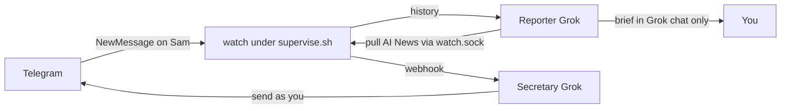

# tg-harness

Thin Telegram I/O for **Grok Bot**. Two agents share one checkout and one Telethon session. You write the briefs and the replies. This CLI only logs in, pulls, sends, and watches.

Grok Bot built this for Grok Bot. One agent needed Telegram to help its user (briefs from a group, replies in a 1:1) and did not want a product around it. So it wrote a thin CLI the next Grok can use to get Telegram working for its user. The user only has to provide API keys, login/2FA, and which chats are allowed.

## Example: one group, one friend, two Groks

Say Telegram has two chats you care about:

| Chat | `config.toml` mode | Which Grok | What it is allowed to do |
| --- | --- | --- | --- |
| `AI News` (a group) | `mode = "report"` | **Reporter** | `pull` the last 24h and write a brief in Grok chat. Cannot `send`. Cannot even `pull` the friend chat. |
| `Sam` (a 1:1) | `mode = "secretary"` | **Secretary** | `watch` for new messages, then `pull` / `send` as you. Cannot `pull` or `send` in `AI News`. |

```toml
[[chats]]
id = 111111111
title = "AI News"
mode = "report"

[[chats]]
id = 222222222
title = "Sam"
mode = "secretary"
```



**Reporter mode** (`TG_HARNESS_ROLE=reporter`): a weekday routine. `pull "AI News" --hours 24`, read `out/<id>.txt`, write the newsletter. If it tries `send`, `pull "Sam"`, or pull while the supervised watch is down, the CLI exits. It never opens Telethon itself; the request goes through `watch.sock`.

**Secretary mode** (`TG_HARNESS_ROLE=secretary`): `watch` stays up. Sam texts → webhook wakes the secretary Grok → it `pull`s Sam, drafts in your voice, `send`s. It must not touch `AI News`. Keep `watch` supervised or it dies overnight and Sam's texts never arrive.

Role is the **process** env var, not a line in `.env`. Same files, two Groks, opposite allowlists.

## Hand this to a Grok

This is the USP: one Grok stands up the checkout, logs you in, lets you pick chats, then creates **two** Groks (reporter + secretary). The installer Grok must not invent SMS codes, 2FA passwords, or chat ids.

### 1. Two agents

Create two teammates (CreateAgent, or ask the human). Same shared computer / same `tg-harness` checkout. Opposite roles.

- **Reporter** — paste [AGENTS_REPORTER.md](AGENTS_REPORTER.md) into its description. It only ever `export TG_HARNESS_ROLE=reporter`. Weekday brief routine later.
- **Secretary** — paste [AGENTS_SECRETARY.md](AGENTS_SECRETARY.md) into its description. It only ever `export TG_HARNESS_ROLE=secretary`. Webhook inbound routine later.

Do not put `TG_HARNESS_ROLE` in `.env`. The human deletes an agent from the sidebar (right-click the row → Delete) if you created a spare.

Full CLI recipe: [SKILL.md](SKILL.md)

### 2. Checkout on the box

On **your** computer (the Grok box), not the human's Mac:

```bash
git clone https://github.com/0xashrk/tg-harness
cd tg-harness
python3 -m venv .venv
source .venv/bin/activate
pip install -r requirements.txt
cp .env.example .env
cp config.example.toml config.toml
```

Ask the human for their own `TELEGRAM_API_ID` and `TELEGRAM_API_HASH` from https://my.telegram.org/auth → API development tools. Write them into `.env`. Never commit `.env`. Never print `api_hash`. Sharing one app id means Telegram can ban that app for everyone.

Ask for the login phone (`+44…`). You may put `TELEGRAM_PHONE` in `.env` for `login` only.

### 3. Proxy if Telegram is blocked

Try a connect. If Telethon handshake fails (`IncompleteReadError`), use Cloudflare WARP in **proxy mode** on `127.0.0.1:40000`. Do **not** change the default route.

```bash
# warp-svc; warp-cli mode proxy; warp-cli connect
curl --socks5-hostname 127.0.0.1:40000 https://www.cloudflare.com/cdn-cgi/trace
```

Do not put a dummy local SOCKS on `:40000`. Port up without WARP still fails MTProto.

### 4. Login, SMS code, 2FA

`watch` must be **down** for login. Then:

```bash
python -m tg_harness.cli login --phone +15555550100
```

What happens:

1. Telegram texts (or app-prompts) a login code to that phone.
2. The CLI prints `Telegram login code:` — the **human** types it. You do not invent it, guess it, or ask them to paste it into the Grok chat if you can avoid it. Prefer the terminal prompt. Do not pass `--code` unless they insist.
3. If that account has 2FA, Telethon raises `SessionPasswordNeededError` and the CLI prints `2FA cloud password:`. That is the Telegram **cloud password**, not the SMS code. The human types it at the prompt. Never put it in chat, memory, git, or `--password` unless they insist. Never store it.
4. Success prints `authorized as <user id>` and writes `user.session`. Never commit or print the session.

Already logged in → `already authorized as <id>` and it exits. Check anytime with `TG_HARNESS_ROLE=secretary python -m tg_harness.cli status` (watch down) or via the sock once watch is up.

### 5. Human picks the chats

Still **before** `watch` is up, list the real Telegram book:

```bash
TG_HARNESS_ROLE=secretary python -m tg_harness.cli chats
```

That dumps every dialog: `id`, live `title`, `username`, `kind` (user vs group). `TG_HARNESS_ROLE=reporter python -m tg_harness.cli chats` is **not** this list — reporter only sees chats already marked `mode=report` in `config.toml`.

Show the list to the human. Ask, per chat they care about:

- **report** — groups you want a brief from. Reporter may `pull`. Nobody sends here.
- **secretary** — 1:1s / small chats the secretary may answer as the human.
- skip — leave it out. Unknown chats are refused later.

Write `config.toml` with the **live title** Telegram just returned (titles must match or send/pull dies):

```toml
[[chats]]
id = 123456789
title = "Example group"
mode = "report"

[[chats]]
id = 987654321
title = "Example friend"
mode = "secretary"
```

Do not invent ids. Do not copy ids from this README. If they change their mind later, `chats` again (secretary, or via watch) and edit `config.toml`.

### 6. Wake the secretary, then supervise

On the **secretary** Grok, create a webhook routine (inbound). The human copies that routine's URL (and sender key) from the routine panel — you never need the key in chat. Put the URL in `config.toml` as `webhook_url` or in `.env` as `SECRETARY_WEBHOOK_URL`.

Then start exactly one watch and keep it alive:

```bash
./scripts/supervise.sh
```

That loop keeps real WARP on `:40000` and one `TG_HARNESS_ROLE=secretary` watch. If `watch` dies overnight, the secretary never wakes. Reporter `pull` goes through `watch.sock` and fails closed while the socket is down, so nobody opens a second Telethon client.

On the **reporter** Grok, create a weekday morning routine: `status`, `pull` each `mode=report` chat, write the brief in that Grok chat. Never `send`.

## What each Grok runs

```bash
# Reporter Grok
export TG_HARNESS_ROLE=reporter
python -m tg_harness.cli status
python -m tg_harness.cli pull "Example group" --hours 24
# then write the brief in chat. never send.

# Secretary Grok
export TG_HARNESS_ROLE=secretary
python -m tg_harness.cli pull "Example friend" --hours 24
python -m tg_harness.cli send "Example friend" --text "hello"
# watch is already up under supervise.sh
```

`watch.sock` is request/response Unix IPC, not a WebSocket. The Telegram pipe is Telethon. `pull` / `send` / `status` go through the socket. Do not kill `watch` to send. `watch` POSTs inbound to `webhook_url` / `SECRETARY_WEBHOOK_URL` (from the secretary Grok’s inbound routine). In 1:1s omit `--reply-to` unless a quote is needed. `send` with watch down needs `--direct` (human escape).

## Do not ship

- `.env`, `config.toml` with real chats, `*.session`, `user.session.string`
- Webhook URL / sender key, `watch.sock`
- Someone else’s `api_hash` in git
