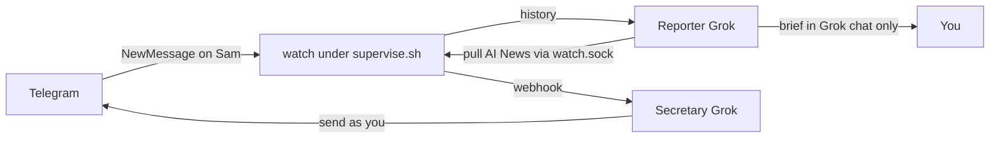

# tg-harness

Thin Telegram I/O for **Grok Bot**. Two agents share one checkout and one Telethon session. You write the briefs and the replies. This CLI only logs in, pulls, sends, and watches.

## Example: one group, one friend, two Groks

Say Telegram has two chats you care about:

| Chat | `config.toml` mode | Which Grok | What it is allowed to do |
| --- | --- | --- | --- |
| `AI News` (a group) | `mode = "report"` | **Reporter** | `pull` the last 24h and write a brief in Grok chat. Cannot `send`. Cannot even `pull` the friend chat. |
| `Sam` (a 1:1) | `mode = "secretary"` | **Secretary** | `watch` for new messages, then `pull` / `send` as you. Cannot `pull` or `send` in `AI News`. |

```toml
[[chats]]
id = 111111111
title = "AI News"
mode = "report"

[[chats]]
id = 222222222
title = "Sam"
mode = "secretary"
```



**Reporter mode** (`TG_HARNESS_ROLE=reporter`): a weekday routine. `pull "AI News" --hours 24`, read `out/<id>.txt`, write the newsletter. If it tries `send`, or `pull "Sam"`, the CLI exits. It never opens Telethon itself; the request goes through `watch.sock`.

**Secretary mode** (`TG_HARNESS_ROLE=secretary`): `watch` stays up. Sam texts → webhook wakes the secretary Grok → it `pull`s Sam, drafts in your voice, `send`s. It must not touch `AI News`. Keep `watch` supervised or it dies overnight and Sam's texts never arrive.

Role is the **process** env var, not a line in `.env`. Same files, two Groks, opposite allowlists.

## Grok Bot setup

Point **two different Groks** at the same checkout. Role is per process (`TG_HARNESS_ROLE`), never in the shared `.env`.

1. **Reporter** — weekday group briefs. `TG_HARNESS_ROLE=reporter`. Can `pull` `mode=report` chats only. `send` is a hard error. Copy [AGENTS_REPORTER.md](AGENTS_REPORTER.md) onto that Grok.
2. **Secretary** — allowlisted 1:1 replies. `TG_HARNESS_ROLE=secretary`. Can `pull` / `send` / `watch` `mode=secretary` chats only. Copy [AGENTS_SECRETARY.md](AGENTS_SECRETARY.md) onto that Grok. Paste the secretary inbound webhook URL + sender key into its routine panel.

One live Telethon client. The secretary keeps `watch` up (use `scripts/supervise.sh`). Reporter `pull` goes through `watch.sock` so it never opens a second client.

Full recipe: [SKILL.md](SKILL.md)

## One-time on the box

```bash
git clone https://github.com/0xashrk/tg-harness
cd tg-harness
python3 -m venv .venv
source .venv/bin/activate
pip install -r requirements.txt
cp .env.example .env
cp config.example.toml config.toml
```

Get your own `api_id` / `api_hash` at https://my.telegram.org/auth → API development tools. Put them in `.env`. Sharing one app id means Telegram can ban that app for everyone.

Fill `config.toml` with the chats each Grok may touch:

```toml
[[chats]]
id = 123456789
title = "Example group"
mode = "report"

[[chats]]
id = 987654321
title = "Example friend"
mode = "secretary"
```

Live Telegram titles must match. Unknown chats are refused. Reporter cannot see secretary chats and vice versa.

### If MTProto is blocked

Do **not** change the machine default route. Use Cloudflare WARP in **proxy mode** on `127.0.0.1:40000` (those values are already in `config.example.toml`).

```bash
# warp-svc; warp-cli mode proxy; warp-cli connect
curl --socks5-hostname 127.0.0.1:40000 https://www.cloudflare.com/cdn-cgi/trace
```

Do not put a dummy local SOCKS on `:40000`. Port up without WARP still fails MTProto.

### Login (once)

```bash
python -m tg_harness.cli login --phone +15555550100
```

SMS/app code, then 2FA if asked. Writes `user.session`. Never commit it, never print it.

Then start the secretary watch and leave it supervised:

```bash
./scripts/supervise.sh
```

That loop keeps real WARP on `:40000` and exactly one `TG_HARNESS_ROLE=secretary` watch. If `watch` dies overnight, the secretary never wakes.

## What each Grok runs

```bash
# Reporter Grok
export TG_HARNESS_ROLE=reporter
python -m tg_harness.cli status
python -m tg_harness.cli pull "Example group" --hours 24
# then write the brief in chat. never send.

# Secretary Grok
export TG_HARNESS_ROLE=secretary
python -m tg_harness.cli pull "Example friend" --hours 24
python -m tg_harness.cli send "Example friend" --text "hello"
# watch is already up under supervise.sh
```

`watch.sock` is request/response Unix IPC, not a WebSocket. The Telegram pipe is Telethon. `pull` / `send` / `status` go through the socket. Do not kill `watch` to send. `watch` POSTs inbound to `webhook_url` / `SECRETARY_WEBHOOK_URL` (from the secretary Grok’s inbound routine). In 1:1s omit `--reply-to` unless a quote is needed. `send` with watch down needs `--direct` (human escape).

## Do not ship

- `.env`, `config.toml` with real chats, `*.session`, `user.session.string`
- Webhook URL / sender key, `watch.sock`
- Someone else’s `api_hash` in git
